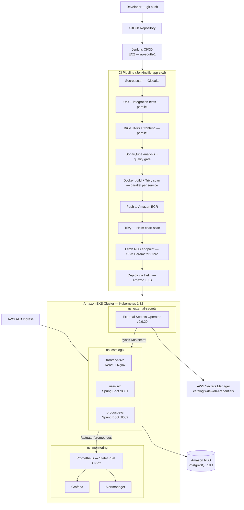

# End-to-End DevSecOps CI/CD Pipeline for Microservices

**Terraform · Jenkins · Ansible · Docker · AWS EKS · Helm · SonarQube · Trivy · Gitleaks · Prometheus · Grafana · External Secrets Operator**
 
> A complete DevSecOps delivery platform for a containerised three-service application on Amazon EKS — focusing on pipeline design, security integration, infrastructure automation, and production-aligned Kubernetes operations.
 
---
 
## Table of contents
 
- [What this project demonstrates](#what-this-project-demonstrates)
- [Tech stack](#tech-stack)
- [Architecture](#architecture)
  - [High-level flow](#high-level-flow)
  - [Infrastructure layers](#infrastructure-layers)
  - [EKS namespace layout](#eks-namespace-layout)
- [CI/CD pipeline stages](#cicd-pipeline-stages)
- [Security integration (DevSecOps)](#security-integration-devsecops)
- [Secrets management](#secrets-management)
- [Infrastructure (Terraform)](#infrastructure-terraform)
- [Server provisioning (Ansible + JCasC)](#server-provisioning-ansible--jcasc)
- [Kubernetes hardening](#kubernetes-hardening)
- [Observability](#observability)
- [Local development](#local-development)
- [How to run](#how-to-run)
- [Design decisions and trade-offs](#design-decisions-and-trade-offs)
- [Known limitations and roadmap](#known-limitations-and-roadmap)
---
 
## What this project demonstrates
 
This project is not about the application — Catalogix is an intentionally simple product-catalog CRUD app so it does not distract from what is actually being demonstrated.
 
What is being demonstrated:
 
- **Automated, secure CI/CD** — a Jenkins pipeline that scans for secrets before doing anything else, runs unit and integration tests in parallel, enforces a SonarQube quality gate, scans every Docker image and Helm chart with Trivy at severity thresholds that fail the build, and only then deploys via Helm to EKS
- **Infrastructure-as-code across two lifecycle layers** — a `bootstrap-infra` layer (VPC, subnets, gateways) that is applied once and left stable, and a `platform-infra` layer (EKS, RDS, ECR, ALB, ESO) that reads VPC outputs from remote state and can be torn down and rebuilt independently
- **Zero-touch secrets** — DB credentials are generated by Terraform, stored in AWS Secrets Manager, synced into the cluster as a Kubernetes Secret by External Secrets Operator, and rotated without any pipeline run or human involvement
- **Production-aligned Kubernetes** — non-root containers, read-only root filesystems, all capabilities dropped, startup/readiness/liveness probes on all services, HPA (min 2/max 4) for all three services, PodDisruptionBudgets, and explicit resource requests and limits
- **Repeatable infrastructure configuration** — Jenkins is not manually configured; Ansible provisions the EC2 and JCasC configures it on first boot with admin credentials, tool installations, pipeline jobs, and SonarQube connection all created automatically
---
 
## Tech stack
 
| Category | Tools |
|---|---|
| Cloud | AWS (EKS, EC2, RDS, ECR, ALB, Secrets Manager, IAM) |
| IaC | Terraform >= 1.12.0 |
| CI/CD | Jenkins (on EC2, configured via Ansible + JCasC) |
| Configuration management | Ansible (dynamic EC2 inventory, idempotent roles) |
| Containerisation | Docker (multi-stage builds) |
| Orchestration | Kubernetes 1.32 (Amazon EKS) |
| Package management | Helm 3.17.0 |
| Static analysis | SonarQube (separate EC2 instance, quality gate enforced) |
| Security scanning | Trivy 0.61.0 (images + Helm/K8s manifests), Gitleaks v8.21.2 |
| Secrets | AWS Secrets Manager + External Secrets Operator v0.9.20 |
| Monitoring | Prometheus (StatefulSet + PVC), Grafana, Alertmanager |
| Application | Spring Boot (user-svc, product-svc), React + Nginx (frontend-svc) |
| Database | PostgreSQL 18.1 (Amazon RDS, `db.t4g.micro`) |
 
---
 
## Architecture
 
### High-level flow
 
```
Developer git push
    └─▶ GitHub (webhook)
            └─▶ Jenkins EC2 (CI pipeline)
                    ├─▶ SonarQube EC2 (static analysis)
                    ├─▶ Amazon ECR (image push)
                    └─▶ Amazon EKS (Helm deploy)
                                ├─▶ ns: catalogix   (frontend, user-svc, product-svc)
                                ├─▶ ns: monitoring  (Prometheus, Grafana, Alertmanager)
                                └─▶ ns: external-secrets (ESO → Secrets Manager)
```
 
### High-level architecture diagram
 

 
### Infrastructure layers
 
Infrastructure is split into two Terraform layers with separate lifecycles:
 
```
terraform/
├── bootstrap-infra/        # Apply once. VPC, subnets, NAT Gateway, IGW, route tables.
│                           # Outputs are written to S3 remote state.
└── platform-infra/
    └── env/dev/            # Reads bootstrap outputs via terraform_remote_state.
        └── modules/
            ├── eks/        # EKS 1.32, managed node group, OIDC, IRSA, gp3 StorageClass
            ├── ecr/        # 3 private repositories (user-svc, product-svc, frontend-svc)
            ├── rds/        # PostgreSQL 18.1, encrypted, private subnet, random password
            ├── alb/        # AWS Load Balancer Controller via Helm + IRSA
            ├── eso/        # External Secrets Operator via Helm + ClusterSecretStore
            ├── secrets-manager/  # Stores DB credentials; accessed only by ESO IRSA role
            └── security-groups/  # Scoped per component; no open 0.0.0.0/0 rules
```
 
The `platform-infra` layer reads VPC and subnet IDs from `bootstrap-infra`'s S3-backed remote state. Network configuration can be updated without touching cluster resources.
 
> **Dev trade-off:** A single NAT Gateway is used to reduce cost. Production requires one NAT Gateway per AZ so a single AZ failure does not cut outbound internet access for all private subnets.
 
### EKS namespace layout
 
| Namespace | Workloads | Managed by |
|---|---|---|
| `catalogix` | frontend-svc, user-svc, product-svc | Jenkins / Helm |
| `monitoring` | Prometheus, Grafana, Alertmanager, kube-state-metrics, node-exporter | platform-infra pipeline / Helm |
| `external-secrets` | External Secrets Operator, ClusterSecretStore | Terraform (eso module) |
 
---
 
## CI/CD pipeline stages
 
Two pipelines — one per Jenkinsfile:
 
### `Jenkinsfile.app-cicd` — triggered on every push to main
 
| Stage | What it does |
|---|---|
| Secret scanning | Gitleaks v8.21.2 scans the full git history; exits with code 1 on any finding |
| AWS authentication | `aws sts get-caller-identity` resolves account ID; sets ECR registry and image tag env vars |
| Unit + integration tests | Maven runs in parallel for both backend services; Testcontainers spins up PostgreSQL for integration tests |
| Build JARs + frontend | `mvn package` and `npm run build` run in parallel |
| SonarQube analysis | Sonar Scanner sends results to the SonarQube EC2; pipeline polls the quality gate and fails on breach |
| Docker build + Trivy scan | All three service images are built and scanned in parallel; Trivy exits with code 1 on HIGH/CRITICAL findings (unfixed CVEs excluded via `.trivyignore` with documented justification) |
| Push to ECR | Images are tagged `MAJOR_VERSION-BUILD_NUMBER` and pushed to ECR |
| Helm chart scan | Trivy scans `helm/catalogix-hc` for Kubernetes misconfigurations; exits on CRITICAL |
| Fetch RDS endpoint | Retrieved from SSM Parameter Store — not hardcoded, not stored as a Jenkins credential |
| Helm deploy | `helm upgrade --install` deploys to the `catalogix` namespace on EKS |
 
### `Jenkinsfile.platform-infra` — triggered manually only
 
Supports `ACTION=apply` (full provisioning) or `ACTION=destroy` (double-gated: must also set `CONFIRM_DESTROY=true`).
 
Stages: terraform fmt check → init → validate → plan → human approval → apply → EKS cluster verification → monitoring stack deploy (kube-prometheus-stack).
 
---
 
## Security integration (DevSecOps)
 
Security is enforced at multiple points in the pipeline — it is not a post-deployment step.
 
| Control | Where | Failure mode |
|---|---|---|
| Secret scanning | Pre-build, every pipeline run | Build fails, no code runs |
| SonarQube quality gate | Post-build | Build fails, no image is pushed |
| Trivy image scan | After Docker build | Build fails, image is not pushed to ECR |
| Trivy Helm/K8s misconfiguration scan | Before deployment | Build fails, deploy does not run |
| Non-root containers | Kubernetes pod spec | Container will not start if misconfigured |
| Read-only root filesystem | Kubernetes security context | Container crashes on write attempt (by design) |
| All capabilities dropped | Kubernetes security context | Applies to all backend services |
| Secrets never in pipeline | ESO + Secrets Manager | No human or Jenkins credential ever holds the DB password |
| EKS API endpoint scoped | Terraform — `public_access_cidrs` | Locked to Jenkins EC2 IP + deployer IP at apply time |
 
CVEs accepted via `.trivyignore` are documented with package name, CVE ID, severity, reason for acceptance, and a revisit condition.
 
---
 
## Secrets management
 
The database password is never known by any human or stored in any CI/CD credential.
 
**Flow:**
 
1. `terraform/platform-infra/modules/rds` generates the password using `random_password` and stores it in Secrets Manager at `catalogix-dev/db-credentials`
2. `terraform/platform-infra/modules/eso` installs External Secrets Operator and creates a `ClusterSecretStore` pointing to Secrets Manager via IRSA (trust policy scoped to only the ESO service account)
3. `helm/catalogix-hc/templates/external-secrets.yaml` defines an `ExternalSecret` resource that instructs ESO to create and maintain the `catalogix-secrets` Kubernetes Secret, refreshing every hour
4. `user-svc` and `product-svc` pods reference `catalogix-secrets` by name — no pod spec change is needed when the secret rotates
The ESO IAM policy allows only `GetSecretValue` and `DescribeSecret`, scoped to `catalogix-dev/*`. No other pod in the cluster can assume the ESO IRSA role.
 
> **Why this matters for interviews:** The previous design required the DB password to be stored as a Jenkins credential. That meant a human had to know it. This design means no human ever handles the password — it is generated, stored, and distributed entirely by code.
 
---
 
## Infrastructure (Terraform)
 
### bootstrap-infra
 
Provisions the network foundation. Designed to be applied once.
 
- Custom VPC with DNS resolution and DNS hostnames enabled
- 2 public subnets (ALB, Jenkins EC2, SonarQube EC2) + 2 private subnets (EKS nodes, RDS)
- Internet Gateway, single NAT Gateway (see trade-offs)
- Kubernetes-required subnet tags applied at subnet creation so the ALB Ingress Controller can auto-discover them
### platform-infra modules
 
**EKS:**
- Kubernetes 1.32, ON_DEMAND managed node group (min 1 / max 2 / desired 2)
- Add-ons pinned to specific versions (`vpc-cni`, `coredns`, `kube-proxy`, `aws-ebs-csi-driver`) — prevents silent upgrades
- OIDC provider for IRSA
- EBS CSI driver with its own IRSA role scoped to only EBS provisioning permissions
- `gp3` StorageClass registered with `WaitForFirstConsumer` binding mode — not set as cluster default to avoid implicit volume provisioning
**RDS:**
- PostgreSQL 18.1 on `db.t4g.micro`
- `storage_encrypted = true`, `publicly_accessible = false`
- `skip_final_snapshot = true` — appropriate for dev; must be changed before any environment where data matters
- Password generated by `random_password` — never visible in Terraform state as plaintext (stored encrypted)
**ESO:**
- ESO v0.9.20 installed via Helm, `wait = true` so CRDs are registered before `ClusterSecretStore` is created
- IAM trust policy scoped to `system:serviceaccount:external-secrets:external-secrets` only
---
 
## Server provisioning (Ansible + JCasC)
 
Jenkins is not manually configured. Running `ansible-playbook playbook.yaml` from a clean EC2 is the only setup step after Terraform applies.
 
**Playbook structure:**
 
| Play | Target | Roles |
|---|---|---|
| Common setup | `all` | `common` (baseline packages), `docker` |
| Jenkins setup | `jenkins` | `devops-tools` (kubectl, Helm, Trivy, AWS CLI, Sonar Scanner), `jenkins` |
| SonarQube setup | `sonarqube` | `sonarqube` (runs as Docker container) |
 
**Tool version management:** All tool versions are defined in `group_vars/all/vars.yaml` as a single source of truth. Each install task checks the currently installed version before downloading — re-running the playbook is idempotent.
 
**JCasC (`roles/jenkins/files/jcasc.yaml`) configures on first boot:**
- Admin user (credentials from environment variables — no hardcoded passwords)
- SonarQube server connection pointing to the SonarQube EC2
- Maven 3.9.9 and Node.js 20.18.0 tool installations
- AWS credentials, GitHub token, and SonarQube token loaded from environment variables as Jenkins credentials
- Both pipeline jobs (`platform-infra` and `app-cicd`) created automatically — Jenkins starts with both jobs already present
**Dynamic inventory:** `ansible/aws_ec2.yaml` discovers Jenkins and SonarQube instances by their EC2 tags. The inventory stays valid when instances stop and restart with new IPs — no hardcoded IP addresses.
 
---
 
## Kubernetes hardening
 
All backend service containers run with this security context:
 
```yaml
securityContext:
  runAsNonRoot: true
  runAsUser: 1000
  readOnlyRootFilesystem: true
  allowPrivilegeEscalation: false
  capabilities:
    drop:
      - ALL
```
 
**`readOnlyRootFilesystem: true` with Spring Boot:** Embedded Tomcat writes to `/tmp` during startup. An `emptyDir` volume is mounted at `/tmp` in every backend Deployment. Without it, the container crashes on startup with a permission error — this was discovered and fixed during testing.
 
**`NET_BIND_SERVICE` on the frontend:** The Nginx container binds port 80. Since this environment reserves port 8080 for Jenkins, Nginx stays on 80 and is granted only `NET_BIND_SERVICE`. All other capabilities remain dropped. A production alternative is switching to an unprivileged Nginx image that listens on 8080.
 
**Health probes on all services:**
- `startupProbe` — `/actuator/health` every 5s, `failureThreshold: 30` (150s total) for JVM startup
- `readinessProbe` — `/actuator/health/readiness` — traffic is only routed to passing pods
- `livenessProbe` — `/actuator/health/liveness` — restarts pods in non-recoverable states
**HPA:** Configured for all three services (`minReplicas: 2`, `maxReplicas: 4`, CPU target 75%). The `replicas` field is intentionally omitted from Deployment specs when HPA is enabled to avoid conflict with HPA replica management.
 
**PodDisruptionBudgets** are defined for all services to ensure availability during node drains.
 
---
 
## Observability
 
Monitoring is deployed as cluster-level infrastructure by the platform pipeline — not the application pipeline — so Prometheus is not restarted on every code push.
 
**Components** (namespace: `monitoring`):
- Prometheus (StatefulSet + PVC on `gp3`, 5Gi, 10-day retention)
- Grafana (dashboards exported as JSON, version-controlled)
- Alertmanager (grouping, deduplication, silence support)
- kube-state-metrics, node-exporter (via kube-prometheus-stack)
**Metrics collection:** Services are annotated for Prometheus autodiscovery:
 
```yaml
prometheus.io/scrape: "true"
prometheus.io/path: /actuator/prometheus
prometheus.io/port: "8081"
```
 
Metrics collected: service availability (`up`), HTTP request rate, 5xx error rate, latency P95 (histogram), JVM CPU usage, JVM heap memory usage. All labeled by `service` and `namespace`.
 
**Alert rules (PrometheusRule resources):**
- `ServiceDown` — service disappears from Prometheus targets
- `HighCPUUsage` — CPU above 80% sustained
- `HighJVMMemoryUsage` — JVM heap exceeds threshold
Alerts were validated by scaling services to zero replicas and observing alert state transitions through `pending → firing`.
 
---
 
## Local development
 
The full stack runs locally using Docker Compose:
 
```bash
cp .env.example .env
# Fill in POSTGRES_USER, POSTGRES_PASSWORD, POSTGRES_DB
 
docker compose up --build
```
 
| Service | Port | Notes |
|---|---|---|
| `postgres` | 5432 | Healthcheck: `pg_isready` |
| `user-svc` | 8081 | Starts after postgres is healthy |
| `product-svc` | 8082 | Starts after postgres is healthy |
| `frontend-svc` | 3000 | Starts after both backend services are healthy |
 
`condition: service_healthy` on the `frontend-svc` dependency prevents the frontend from starting against an unavailable API.
 
---
 
## How to run
 
> **Prerequisites:** AWS account (ap-south-1 by default — change `AWS_REGION` and `CLUSTER_NAME` in both Jenkinsfiles), Terraform >= 1.12.0, Ansible, AWS CLI configured with sufficient IAM permissions.
 
### Step 1 — Bootstrap networking
 
```bash
cd terraform/bootstrap-infra
cp terraform.tfvars.example terraform.tfvars  # fill in your values
terraform init
terraform apply
```
 
This creates the VPC, subnets, and writes outputs to the S3 backend defined in `backend-bootstrap/`.
 
### Step 2 — Provision and configure CI/CD servers
 
```bash
cd terraform/bootstrap-infra
# Note the Jenkins and SonarQube EC2 public IPs from outputs
 
cd ansible
# Update group_vars/all/vars.yaml with your GIT_REPO_URL
# Export credentials Jenkins will need:
export JENKINS_ADMIN_USER=admin
export JENKINS_ADMIN_PASSWORD=<your-password>
export AWS_ACCESS_KEY_ID=<key>
export AWS_SECRET_ACCESS_KEY=<secret>
export GITHUB_TOKEN=<token>
export SONARQUBE_TOKEN=<token>
 
ansible-playbook playbook.yaml
```
 
Ansible discovers the EC2 instances by tag using the dynamic inventory in `aws_ec2.yaml`. After the playbook completes, Jenkins is fully configured — both pipeline jobs are present and ready.
 
### Step 3 — Provision platform infrastructure
 
In Jenkins, trigger `Jenkinsfile.platform-infra` manually with `ACTION=apply`. This runs:
- Terraform (fmt → init → validate → plan → human approval → apply)
- EKS cluster verification
- Monitoring stack deployment (kube-prometheus-stack via Helm)
### Step 4 — Deploy the application
 
Push to the `main` branch. `Jenkinsfile.app-cicd` triggers automatically and runs the full pipeline from secret scanning through Helm deployment.
 
---
 
## Design decisions and trade-offs
 
### 1. Jenkins on EC2 over a managed CI/CD service
 
Jenkins was chosen over GitHub Actions or AWS CodePipeline to reflect self-managed CI/CD environments common in enterprises and mid-size product companies. It required solving a real configuration problem — how to provision and configure Jenkins repeatably — which led to the JCasC + Ansible design. A managed service would have removed that engineering problem from the project scope entirely.
 
**Trade-off:** More operational overhead — Jenkins infrastructure needs to be provisioned, patched, and maintained.
 
### 2. SonarQube on a separate EC2 instance
 
Static analysis is CPU and memory intensive. Running SonarQube on the same instance as Jenkins causes resource contention during pipeline execution. Separation mirrors how most teams actually run SonarQube — as a long-lived shared service, not co-located with build infrastructure.
 
**Trade-off:** Additional EC2 cost and a second server to manage.
 
### 3. External Secrets Operator over Jenkins credentials
 
The original design stored the DB password as a Jenkins credential. This was replaced with ESO because: the password no longer needs to be known by anyone, secrets stay in sync with Secrets Manager automatically every hour, and the Jenkins pipeline has no dependency on a sensitive credential value.
 
**Trade-off:** ESO is an additional cluster component that must be provisioned and kept running. If ESO goes down, secret sync stops (existing secrets remain valid until the pod restarts or the K8s Secret is deleted).
 
### 4. Two-layer Terraform (bootstrap-infra + platform-infra)
 
The VPC can be modified independently without risk to the EKS cluster. The cluster can be torn down and rebuilt without re-provisioning the network. `platform-infra` reads VPC outputs via `terraform_remote_state` — subnet IDs are never manually copied between layers.
 
**Trade-off:** Two separate `terraform apply` operations required for initial setup. Apply order is enforced by convention, not code.
 
### 5. Monitoring deployed by the platform pipeline, not the application pipeline
 
Monitoring is cluster-level infrastructure. Deploying it from the application pipeline would mean every code commit potentially restarts Prometheus. Prometheus manages its own state (StatefulSet + PVC) — a restart mid-scrape is disruptive.
 
**Trade-off:** A separate manual trigger is required to update the monitoring stack.
 
### 6. Trivy `--ignore-unfixed` flag
 
Unfixed CVEs have no available patched version — blocking a deployment on them provides no security benefit. Accepted findings are documented in `.trivyignore` with package name, CVE ID, severity, reason, and a revisit condition.
 
**Trade-off:** Unfixed vulnerabilities are not surfaced in pipeline output, which could mask them from the team. Compensating control: `.trivyignore` is version-controlled and reviewed at base image updates.
 
---
 
## Known limitations and roadmap
 
| Limitation | Planned fix |
|---|---|
| Static IAM credentials for Jenkins AWS auth | Switch to EC2 instance profile; `aws_iam_instance_profile` block is already scaffolded in `bootstrap-infra/iam.tf` |
| Single NAT Gateway | One NAT Gateway per AZ for production multi-AZ HA |
| HTTP only | ACM certificate + HTTPS listener — Ingress template comments document the exact annotations needed |
| `skip_final_snapshot = true` on RDS | Must be `false` in any environment where data matters |
| No multi-environment Terraform workspaces | `env/staging/` and `env/prod/` directory structure is planned |
| `ALLOWED_ORIGINS: "*"` on backend services | Scope to the ALB hostname in staging and production values files |
 
These are acknowledged trade-offs made to keep the project focused and deployable within a single AWS account on a dev budget.