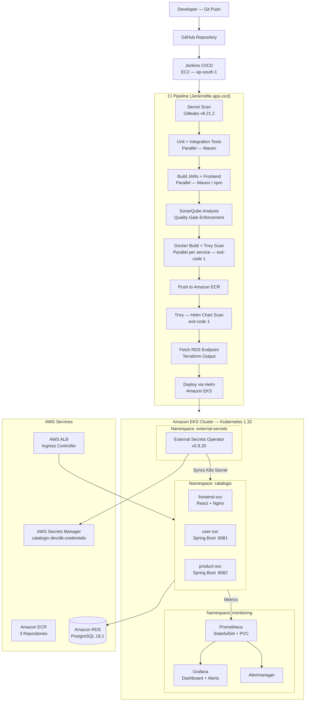

# End-to-End DevSecOps CI/CD Pipeline for Microservices

**(Terraform · Jenkins · Ansible · Docker · AWS · Terraform · Helm · SonarQube · Trivy · Gitleaks · Prometheus · Grafana · External Secrets Operator)**

---

## Project Overview

This project implements a complete DevSecOps delivery platform for a containerized, three-service application deployed on Amazon EKS. The focus is on **pipeline design, security integration, infrastructure automation, and production-aligned Kubernetes operations** — not application business logic.

The application — *Catalogix*, a product catalog with user management — is intentionally simple so it does not distract from what the project is actually demonstrating: how services are built, scanned, secured, deployed, and monitored in a cloud-native environment.

The primary objective is to showcase secure, automated application delivery using modern DevOps and DevSecOps practices, including:

- CI/CD pipeline automation using Jenkins
- Containerization of microservices using Docker
- Deployment and orchestration using Kubernetes and Helm
- Infrastructure Provisioning using Terraform
- Static code analysis and quality enforcement using SonarQube
- Container and configuration security scanning using Trivy
- Monitoring and alerting using Prometheus and Grafana

---

## Cloud Platform and Infrastructure (AWS)

This project is deployed and validated on Amazon Web Services (AWS) to simulate a production-like cloud environment.

**AWS Services Used**

- **Amazon EC2** 
    - Hosts Jenkins and supporting CI/CD tooling
    - Hosts SonarQube on a Separate instance for isolation
    - This separation improves stability, mirrors common enterprise CI/CD layouts, and avoids performance contention between pipeline execution and static analysis.
- **Amazon EKS** 
    - Managed Kubernetes cluster for application runtime
- **Amazon ECR**
    - Private container registry for application images
- **AWS IAM**
    - Fine-grained access control for EKS and ECR integration

**Design Considerations**

- Jenkins runs on EC2 to reflect commonly used self-managed CI/CD setups.
- SonarQube runs on a separate EC2 instance to isolate resource-intensive analysis workloads.
- Kubernetes workloads run on Amazon EKS, leveraging a managed control plane while retaining full Kubernetes primitives.
- Container images are securely pushed to and pulled from Amazon ECR using IAM-based authentication.
- Static cloud credentials are avoided wherever possible in favor of IAM roles and policies. 

This approach balances cloud realism with project scope clarity, keeping the focus on DevSecOps workflows rather than infrastructure automation.

### Identity & Access Management (AWS IAM)

The project uses AWS IAM roles and policies to enforce secure, least-privilege access across CI/CD and Kubernetes components:

- IAM roles and policies are configured for Amazon EKS to allow cluster control plane operations and managed add-ons.
- IAM permissions enable Kubernetes worker nodes and CI/CD tooling to pull container images securely from Amazon ECR.
- Access to AWS services is authenticated using IAM-based mechanisms rather than static credentials wherever possible.

This setup reflects real-world cloud security practices by separating responsibilities between CI/CD tooling, Kubernetes runtime, and AWS-managed services.

---

## Architecture Overview

### High-Level Architecture

- Microservices are developed using Spring Boot
- Each service is containerized using Docker
- Jenkins orchestrates the CI/CD pipeline
- SonarQube performs static code analysis with quality gates
- Trivy scans container images and Kubernetes manifests
- Helm charts manage Kubernetes deployments
- Kubernetes handles service orchestration, scaling, and health checks
- Prometheus and Grafana provide service-level monitoring and alerting

#### High-Level Architecture Diagram



### Two-Layer Infrastructure Architecture

Infrastructure is split into two independent Terraform layers to separate lifecycle concerns:

```
bootstrap-infra/          ← Apply once. Rarely changed.
  └── VPC, subnets, NAT Gateway, route tables, Internet Gateway

platform-infra/           ← Apply per environment. Reads bootstrap outputs via remote_state.
  └── EKS 1.32, ECR, RDS PostgreSQL 18.1, ALB Controller,
      Secrets Manager, External Secrets Operator
```

The `platform-infra` layer reads VPC/subnet IDs from `bootstrap-infra`'s S3-backed remote state rather than hardcoding them. This means networking can be updated independently without touching cluster resources.

#### Infrastructure Layout

* **Jenkins EC2** — hosts Jenkins and CI/CD tooling; configured by Ansible
* **SonarQube EC2** — separate EC2 for isolated static analysis; configured by Ansible
* **Amazon EKS** — managed Kubernetes cluster; application runtime
* **Amazon RDS (PostgreSQL)** — managed database; endpoint injected into Helm at deploy time via terraform output
* **Amazon ECR** — private container registry
* **AWS ALB** — internet-facing load balancer; traffic routed to services via Kubernetes Ingress (TLS-ready via ACM)
* **AWS Secrets Manager + ESO** — DB credentials pulled into the cluster automatically; no static secrets in Jenkins or pipeline code

### Application Runtime

Applications run on Kubernetes,packaged and deployed using Helm.

Namespace: ```catalogix```

Deployed workloads:

- ``frontend-svc`` – UI service (Deployment)
- ``user-svc`` – Backend microservice (Deployment)
- ``product-svc`` – Backend microservice (Deployment)
- ``postgres`` – Database (StatefulSet + PVC)

Runtime characteristics

- Containers run as non-root
- Persistent storage managed via PVCs
- Init containers enforce startup ordering
- Internal communication via Kubernetes Services

This setup ensures secure defaults, correct stateful behavior, and production-aligned Kubernetes patterns.

### Kubernetes Namespace Layout

| Namespace | Workloads | Managed By |
|---|---|---|
| `catalogix` | frontend-svc, user-svc, product-svc | Jenkins / Helm |
| `monitoring` | Prometheus, Grafana, Alertmanager, kube-state-metrics, node-exporter | Platform pipeline / Helm |
| `external-secrets` | External Secrets Operator | Terraform (ESO module) |

### Observability & Monitoring

Monitoring is deployed as cluster-level infrastructure, decoupled from the CI/CD pipeline.

Namespace: ``monitoring``

Components:

- Prometheus (StatefulSet + PVC)
- Grafana (Dashboards & visualization)
- Alertmanager
- kube-state-metrics
- node-exporter

Monitoring is installed once per cluster and operates independently of application deployments.

This avoids unnecessary redeployments and reflects real-world platform engineering practices.

---

## Tech Stack

- **CI/CD**: Jenkins(Groovy Pipeline)
- **Containerization**: Docker, Amazon ECR
- **Cloud Platform**: AWS (EC2, EKS, ECR, RDS, ALB, IAM, Secrets Manager)
- **Orchestration**: Kubernetes (Amazon EKS), Helm
- **Infrastructure Provisioning (IaC)**: Terraform
- **Configuration Management**: Ansible + Jenkins JCasC
- **Security & Quality**: SonarQube(SAST), Trivy(Container & Config Scan), Gitleaks
- **Backend Services**: Spring Boot (Microservices)
- **Frontend Services**: React
- **Secrets Management**: AWS Secrets Manager + External Secrets Operator
- **Observability**: Prometheus, Grafana

---

## Repository Structure
```
aws-cicd-devsecops/
|                    
├── docker-compose.yaml             # Local development compose file 
├── Jenkinsfile.app-cicd            # Application CI/CD pipeline
├── Jenkinsfile.platform-infra      # Infrastructure provisioning pipeline
├── pom.xml                         # Maven aggregator (user-svc + product-svc)
├── .trivyignore
├── README.md
|
├── frontend-svc/
│   └── src/
|   └── .dockerignore
|   └── Dockerfile
|   └── nginx.conf
|   └── package.json
│
├── user-svc/
|   └── src/
|   └── .dockerignore
|   └── Dockerfile
|   └── pom.xml
|   └── sonar-project.properties
|
├── product-svc/
|   └── src/
|   └── .dockerignore
|   └── Dockerfile
|   └── pom.xml
|   └── sonar-project.properties
│
├── helm/
│   └── catalogix-hc/               # Application Helm chart
│   |   ├── templates/
|   |   |   ├── frontend.yaml
|   |   |   ├── user.yaml           # Deployment + Service — with startup/readiness/liveness probes
|   |   |   ├── product.yaml        # Deployment + Service — with startup/readiness/liveness probes
|   |   |   ├── ingress-alb.yaml    # AWS ALB Ingress
|   |   |   ├── external-secrets.yaml   # ESO ExternalSecret resource
|   |   |   └── hpa.yaml
│   |   ├── values-dev.yaml
|   |   └── Chart.yaml
|   └── monitoring/                 # kube-prometheus-stack wrapper chart
|       ├── dashboards/
|       ├── templates/
|       |   ├── catalogix-dashboard-cm.yaml
|       |   ├── ingress.yaml
|       |   └── servicemonitors.yaml
|       ├── README.md
|       ├── Chart.yaml
|       └── values-dev.yaml
|
├── terraform/
│   ├── bootstrap-infra/           # EC2, IAM, VPC, security groups for Jenkins/SonarQube
│   └── platform-infra/
│       ├── modules/
│       │   ├── alb/               # AWS ALB + Ingress Controller
│       │   ├── ecr/               # ECR repositories
│       │   ├── eks/               # EKS cluster + node groups
│       │   ├── eso/               # External Secrets Operator + ClusterSecretStore
│       │   ├── rds/               # RDS PostgreSQL instance
│       │   ├── secrets-manager/   # AWS Secrets Manager secret
│       │   └── security-groups/
│       └── env/
│           └── dev/               # Dev environment Terraform root
│
└── ansible/
    ├── playbook.yaml              # Configures Jenkins EC2 and SonarQube EC2
    ├── aws_ec2.yaml               # Dynamic EC2 inventory
    ├── ansible.cfg
    ├── group_vars/
    └── roles/
        ├── common/                # Baseline packages for all instances
        ├── docker/                # Docker installation
        ├── devops-tools/          # kubectl, helm, trivy, AWS CLI, etc.
        ├── jenkins/               # Jenkins install + JCasC configuration + plugin management
        |   └── files
        |       ├── jcasc.yaml         # Full Jenkins config-as-code: credentials, tools, jobs
        |       └──plugins.yaml       # Plugins list for automated install
        └── sonarqube/             # SonarQube as Docker container

```
---

## Application Pipeline (Jenkinsfile.app-cicd)

Triggered automatically on every push to main. Scoped to application delivery only — does not touch cluster infrastructure or monitoring.

### Pipeline Stages

Stage: What it does

- Clean Workspace: Wipes the Jenkins workspace
- Checkout: Pulls source from GitHub
- Secret Scanning - Runs Gitleaks; fails on detected secrets
-AWS Authentication: Calls sts get-caller-identity to resolve account ID; sets ECR registry and image tag env vars
- Unit & Integration Tests: Runs mvn clean verify in parallel for user-svc and product-svc; integration tests use Testcontainers (PostgreSQL)
- Build Artifacts: Parallel: Maven JAR builds for backend services + npm ci && npm run build for frontend
- SonarQube Analysis: Aggregated mvn sonar:sonar scan; pipeline blocks on Quality Gate result — fails if gate not passed
- Build Docker Images + Trivy Image Scan Parallel per service: Docker build → Trivy scan (--severity HIGH,CRITICAL --exit-code 1 --ignore-unfixed)
- Login to Amazon ECR aws ecr get-login-password piped to docker login
- Push Images to ECR: Parallel push of all three images with <major>.<build-number> tag Validate Kubernetes Access: aws eks update-kubeconfig → kubectl get nodes
- Trivy Scan Helm Charts Scans: helm/catalogix-hc for Kubernetes misconfigurations using .trivyignore
- Fetch RDS Endpoint: Reads rds_endpoint from terraform output in the dev environment
- Deploy to EKS via Helm: helm upgrade --install with --wait --timeout 180s; injects ECR registry, image tag, and RDS endpoint
- Wait for Deployment Rollout: kubectl rollout status for all three services
- Post-Deployment Verification: kubectl get pods/svc/ingress
  - Post: failure: Automatic helm rollback to the previous release
  - Post: always: docker system prune -f to reclaim Jenkins agent disk space

**Image tag format**: <MAJOR_VERSION>-<BUILD_NUMBER> (e.g., 1.0-42)

### Key Pipeline Decisions

**Gitleaks runs before everything else.** Secret scanning is placed as stage 1, before any AWS authentication or build steps. There is no value in building and scanning an image if the source code already contains leaked credentials.

**SonarQube uses Maven aggregator scan from the repo root.** Running `mvn sonar:sonar` from the root with a parent `pom.xml` covers both `user-svc` and `product-svc` in a single scan under the same project key (`catalogix`). This is more accurate than running separate scans per service because cross-module dependencies are visible. The `waitForQualityGate abortPipeline: true` call blocks the pipeline until SonarQube reports the gate result — if the gate fails, no images are ever built.

**Trivy scans images immediately after build, before ECR push.** Image scanning and push are kept in the same parallel job per service. Scanning happens before the `docker push` step. If a CRITICAL or HIGH vulnerability is found (`--exit-code 1`, `--ignore-unfixed`), the image is never pushed to the registry. This is different from scanning an image after it is already in the registry — it ensures the registry never contains a known-vulnerable image.

**Helm chart is scanned separately from images.** Kubernetes manifests can contain misconfigurations independent of the image content — overly permissive security contexts, missing resource limits, exposed sensitive environment variables. The Trivy Helm scan (`trivy config`) runs against the chart directory and also uses `exit-code 1` with `--ignorefile` to suppress accepted false positives documented in `.trivyignore`.

**RDS endpoint is read from Terraform output, not hardcoded.** The `Fetch RDS Endpoint` stage runs `terraform output -raw rds_endpoint` from the platform-infra directory. This means the pipeline always uses the current actual RDS endpoint regardless of any infrastructure changes, and the endpoint never needs to be stored as a Jenkins credential.

**Helm rollback on failure.** The `post { failure }` block runs `helm rollback catalogix` automatically. This is not a manual step.

**`disableConcurrentBuilds()`** prevents two pipeline runs from deploying simultaneously and creating a race condition on the EKS deployment state.

---

## Infrastructure Pipeline (Jenkinsfile.platform-infra)

The infrastructure pipeline is **triggered manually only** — never via webhook. It provisions the AWS infrastructure and deploys the monitoring stack in a single controlled workflow.

### Pipeline Stages

Stage: What it does

- Clean Workspace: Wipes workspace
- Checkout: Pulls source using github-token credential
- Terraform Format Check: terraform fmt -check -recursive
- Terraform Init: terraform init 
- Terraform Validate: terraform validate
- Terraform Plan: terraform plan -out main.tfplan
- Approval: Human must review plan output and click Apply before infrastructure changes
- Terraform Apply: terraform apply -auto-approve main.tfplan
- Verify EKS Cluster: Queries cluster status via aws eks describe-cluster
- Deploy Monitoring Stack: helm dependency update + helm upgrade --install of kube-prometheus-stack
- Verify Monitoring Stack: kubectl get pods/svc -n monitoring

The monitoring stack is deployed here — after cluster and ESO are confirmed ready — rather than as a separate manual step. This makes the platform-infra pipeline the single entry point for all cluster-level infrastructure.

---

## Infrastructure Design (Terraform)

### bootstrap-infra — VPC Layer

Provisions the network foundation that all other resources share. Designed to be applied once and left stable.

- Custom VPC with DNS support enabled
- 2 public subnets (ALB, Jenkins EC2, SonarQube EC2)
- 2 private subnets (EKS worker nodes, RDS)
- Internet Gateway for public subnet inbound traffic
- Single NAT Gateway in public subnet 0 for private subnet outbound access
- Kubernetes-required subnet tags (`kubernetes.io/role/elb`, `kubernetes.io/role/internal-elb`) applied at subnet creation so the ALB controller can discover them

> **Dev vs Production trade-off:** A single NAT Gateway is used to reduce cost. In production, one NAT Gateway per availability zone is required so a single AZ failure does not cut outbound internet access for all private subnets.

### platform-infra — Cluster Layer

Reads VPC/subnet IDs from bootstrap-infra's S3 remote state. All modules consume these values from a single `locals` block so there is no duplication.

**EKS module:**
- Kubernetes 1.32, managed node group (ON_DEMAND, min 1 / max 2 / desired 2)
- EKS add-ons pinned to specific versions (vpc-cni, coredns, kube-proxy, aws-ebs-csi-driver) — versions are explicit to prevent silent upgrades
- OIDC provider created for IRSA (IAM Roles for Service Accounts)
- EBS CSI driver configured with its own dedicated IRSA role so its service account can provision EBS volumes without any other permissions
- `gp3` StorageClass with `WaitForFirstConsumer` binding mode registered for Prometheus and Grafana PVC requests. Not set as the cluster default to avoid silently provisioning volumes for workloads that did not explicitly request it

**ESO module:**
- Installs External Secrets Operator v0.9.20 via Helm into `external-secrets` namespace
- Creates a dedicated IAM role with a trust policy scoped to only the ESO service account (`system:serviceaccount:external-secrets:external-secrets`) — no other pod in the cluster can assume this role
- IAM policy allows only `GetSecretValue` and `DescribeSecret`, scoped to secrets matching `catalogix-dev/*`
- Creates `ClusterSecretStore` resource only after the ESO Helm chart is fully deployed and CRDs are registered (`wait = true`)

**RDS module:**
- PostgreSQL 18.1 on `db.t4g.micro`
- `storage_encrypted = true`
- `publicly_accessible = false` — accessible only from within the VPC via the RDS security group
- DB password generated by `random_password` in Terraform — no human ever handles or knows the password
- Password stored in Secrets Manager under `catalogix-dev/db-credentials`; retrieved by ESO at runtime

---

## Containerization (Docker)

- Each microservice uses a multi-stage Dockerfile
- Build and runtime stages are separated
- Lightweight runtime images are used to reduce attack surface

This improves **security, portability, and deployment consistency**.

---

## Kubernetes & Helm Deployment

### Kubernetes

- Services are deployed as **Kubernetes Deployments**
- Health probes (startup, readiness, liveness) ensure application reliability
- Resource requests and limits enforce controlled resource usage

### Helm

- Helm charts manage Kubernetes manifests
- Values files enable environment-specific configuration
- Helm enables **versioned and repeatable deployments**

This setup mirrors **real-world Kubernetes deployment patterns**.

---

## DevSecOps Integration

### Static Code Analysis (SonarQube)

- Jenkins integrates SonarQube for code quality checks
- Quality gates enforce minimum standards before deployment

### Container & Configuration Security (Trivy)

- Docker images are scanned for HIGH and CRITICAL vulnerabilities
- Helm and Kubernetes manifests are scanned for misconfigurations
- Pipeline execution fails on critical security findings

Security is treated as a **first-class citizen** throughout the CI/CD lifecycle.

---

## Secrets Management

Database credentials are managed entirely outside Jenkins:

1. The ```secrets-manager``` Terraform module creates the DB password secret in AWS Secrets Manager.
2. The ```eso``` Terraform module deploys External Secrets Operator and creates a ```ClusterSecretStore``` referencing Secrets Manager via IRSA.
3. The ```ExternalSecret``` resource in ```helm/catalogix-hc/templates/external-secrets.yaml``` instructs ESO to create and maintain the ```catalogix-secrets``` Kubernetes Secret, refreshed every hour.
4. user-svc and product-svc pods reference catalogix-secrets by name — no changes to pod specs required when the secret rotates.

This approach had two problems. First, the DB password had to be stored as a Jenkins credential, meaning a human had to know it, copy it, and paste it. Second, the secret was only updated when the pipeline ran — if Secrets Manager was rotated, the Kubernetes secret would be stale until the next deployment.

The pipeline was redesigned to use the External Secrets Operator. ESO is installed into the cluster via Terraform. A `ClusterSecretStore` is created that points to AWS Secrets Manager. The `ExternalSecret` resource in the Helm chart (`templates/external-secrets.yaml`) tells ESO to pull the `db_pass` key from `catalogix-dev/db-credentials` and create/maintain the `catalogix-secrets` Kubernetes Secret automatically, refreshing every hour.

The Jenkins credential for the DB password was removed entirely. The manual kubectl stage was commented out and documented in the Jenkinsfile explaining why it was replaced. The RDS password is now generated by Terraform, stored in Secrets Manager, and reaches the application pods without any human ever touching it.

---

## Kubernetes Security Hardening

The Helm deployment templates enforce the following security context for all backend service containers:

```yaml
securityContext:
  runAsNonRoot: true
  runAsUser: 1000
  readOnlyRootFilesystem: true
  allowPrivilegeEscalation: false
  capabilities:
    drop:
      - ALL
```

`readOnlyRootFilesystem: true` prevents any process inside the container from writing to the container filesystem. Since Spring Boot's embedded Tomcat writes to `/tmp` during startup, an `emptyDir` volume is mounted at `/tmp` in every backend service Deployment. Without this volume, the container would crash on startup with a permission error.

All three services define three health probe types:
- **startupProbe** — checks `/actuator/health` every 5 seconds with `failureThreshold: 30` (150 seconds total) so the JVM has time to initialize before liveness kicks in
- **readinessProbe** — checks `/actuator/health/readiness`; traffic is only routed to pods that pass this check
- **livenessProbe** — checks `/actuator/health/liveness`; restarts the pod if it enters a non-recoverable state

HPA is configured in `values-dev.yaml` for all three services (minReplicas: 2, maxReplicas: 4, CPU target: 75%). When HPA is enabled, the `replicas` field is intentionally omitted from the Deployment spec to avoid conflicting with HPA's replica management.

---

## Jenkins Setup — Ansible + JCasC

Jenkins is not manually configured. Ansible provisions and fully configures a Jenkins instance from a clean EC2 with no manual steps after Ansible runs.

Tool versions are defined in `group_vars/all.yaml` as a single source of truth — kubectl v1.32.0, Helm v3.17.0, Trivy 0.61.0, Sonar Scanner CLI 6.2.1.4610. Each install task checks the currently installed version before downloading, so re-running the playbook is idempotent.

JCasC (`roles/jenkins/files/jcasc.yaml`) configures on first boot:
- Admin user with credentials sourced from environment variables (no hardcoded passwords)
- SonarQube server connection pointing to the SonarQube EC2
- Maven 3.9.9 and Node.js 20.18.0 tool installations
- AWS credentials, GitHub token, and SonarQube token loaded from environment variables as Jenkins credentials
- Both pipeline jobs (`platform-infra` and `app-cicd`) created automatically — Jenkins starts with both jobs already present

**One issue found and fixed during setup:** The Sonar Scanner CLI was extracted to `/opt/` but the binary directory was never added to `$PATH`. The Ansible task was updated to create a symlink at `/usr/local/bin/sonar-scanner` pointing to the versioned binary path so `sonar-scanner` is available system-wide without modifying the `$PATH` variable globally.

Dynamic EC2 inventory (`aws_ec2.yaml`) discovers Jenkins and SonarQube instances by their EC2 tags rather than hardcoded IPs — so the inventory remains valid if instances are stopped and restarted with new IPs.

---

## Server Provisioning (Ansible)

Ansible configures the two EC2 instances provisioned by Terraform bootstrap:

Play               Target          Roles Applied
All instances      ```all```       ```common``` (baseline packages), ```docker```
Jenkins server     ```jenkins```   ```devops-tools``` (kubectl, helm, trivy, AWS CLI, etc.), ```jenkins``` (install + JCasC config)
SonarQube server   ```sonarqube``` ```sonarqube``` (runs as Docker container)

Dynamic EC2 inventory is managed via ```ansible/aws_ec2.yaml```.

---

## Testing & Quality Assurance

### Testing Strategy

- Unit Tests
  - Validate core service logic using JUnit and Mockito
- Integration Tests
  - Database interactions tested using Testcontainers with PostgreSQL

### CI Integration

- Tests run automatically via:

```bash
mvn clean verify
```

- Integration tests execute as part of the Maven lifecycle
- Test failures immediately fail the pipeline

### Code Coverage

- JaCoCo generates coverage reports for visibility
- Coverage reports are reviewed but strict percentage gates are intentionally not enforced

This avoids artificial test inflation and keeps the focus on meaningful testing and CI stability.

---

## Observability

This project implements production-style monitoring and alerting for Kubernetes-based microservices using Prometheus, Grafana, and Alertmanager.

### Monitoring Architecture

- **Prometheus** is deployed inside the Kubernetes cluster and uses Kubernetes service discovery to automatically detect and scrape application metrics.
- **Microservices** expose metrics via Spring Boot Actuator (/actuator/prometheus), enabled through service annotations.
- **Grafana** queries Prometheus as a data source to visualize service health and performance.
- **Alertmanager** receives alerts from Prometheus and manages alert grouping, deduplication, and routing.

```
Application → Prometheus → (Metrics) → Grafana
              Prometheus → (Alerts)  → Alertmanager
```

### Metrics Collection

Prometheus dynamically scrapes services annotated with:

```yaml
prometheus.io/scrape: "true"
prometheus.io/path: /actuator/prometheus
prometheus.io/port: "8081" / "8082"
```
- Microservices expose metrics via Spring Boot Actuator (``/actuator/prometheus``)
- Prometheus discovers targets automatically using Kubernetes-native mechanisms

Collected metrics include:

  - Service availability (up)
  - HTTP request rate and error rate
  - Latency (P95) using Prometheus histograms
  - JVM CPU usage
  - JVM heap memory usage

Metrics are labeled by service and namespace, enabling clean dashboards and scalable alerting.

### Grafana Dashboards

Grafana dashboards provide:

- Service selector variable to dynamically switch between services for multi-service monitoring
- Service availability (UP / DOWN)
- Request rate and 5xx error rate
- Latency (P95)
- CPU usage per service
- JVM heap memory usage

Dashboards are designed to be **service-centric**, avoiding pod IPs and low-level noise, making them suitable for both operational monitoring.

Dashboards were created via the Grafana UI and exported as JSON for version control.

### Alerting (Prometheus + Alertmanager)

Prometheus evaluates alert rules defined via ConfigMaps and mounted into the Prometheus container.

Alert rules are defined using PrometheusRule resources via Helm

Key alerts include:

- ```ServiceDown``` – triggered when a service disappears from Prometheus targets.
- ```HighCPUUsage``` – CPU usage above 80% for sustained periods.
- ```HighJVMMemoryUsage``` – JVM heap usage exceeding safe thresholds.

Alerts are forwarded to Alertmanager, which:

- Groups related alerts
- Prevents alert storms
- Supports silencing and future notification integrations

Alerts were validated by intentionally scaling services to zero replicas and observing alert state transitions.

Alerts include service and namespace labels, making correlation with dashboards straightforward.

---

## How to Run the Project

### Prerequisites

To run this project end-to-end:

- AWS account (ap-south-1 configured; change ```AWS_REGION``` and ```CLUSTER_NAME``` in both Jenkinsfiles if using a different region)
- Terraform >= 1.12.0
- Ansible
- Jenkins with the following credentials configured:
  - ```aws-creds``` — AWS credentials binding
  - ```github-token``` — GitHub personal access token
  - ```sonarqube``` — SonarQube server configured in Jenkins
- Docker
- ```kubectl```, ```helm``` on the Jenkins agent

### High-Level Execution Flow

1. Run terraform/bootstrap-infra to provision Jenkins and SonarQube EC2 instances
2. Run Ansible playbook.yaml to configure the EC2 instances
3. Trigger Jenkinsfile.platform-infra manually — provisions EKS, RDS, ECR, ALB, ESO, and deploys monitoring
4. Push code to main — Jenkinsfile.app-cicd triggers automatically, builds and deploys to EKS

Detailed environment-specific setup steps are intentionally abstracted to keep the focus on **CI/CD pipeline design and DevSecOps concepts**.

---

## Local Development

The full stack runs locally using Docker Compose:

```bash
cp .env.example .env
# Fill in POSTGRES_USER, POSTGRES_PASSWORD, POSTGRES_DB

docker compose up --build
```

Services and their local ports:
- `postgres` — port 5432 (with healthcheck: `pg_isready`)
- `user-svc` — port 8081 (depends on postgres healthy)
- `product-svc` — port 8082 (depends on postgres healthy)
- `frontend-svc` — port 3000 (depends on user-svc and product-svc healthy)

The `frontend-svc` container starts only after both backend services pass their healthchecks (`condition: service_healthy`), preventing frontend from starting against an unavailable API.

---

## Design Decisions

### 1. Jenkins on EC2 over a Managed CI/CD Service

Jenkins was chosen over GitHub Actions or AWS CodePipeline to reflect self-managed CI/CD environments that are common in enterprises and many mid-size product companies. It also required solving a real configuration problem — how to provision and configure Jenkins repeatably — which led to the JCasC + Ansible setup. A managed service would have removed that engineering layer from the project scope.

**Trade-off:** More operational overhead. Jenkins infra needs to be provisioned, patched, and maintained.

### 2. SonarQube on a Separate EC2 Instance

SonarQube is installed on its own EC2 instance rather than on the Jenkins server. Static analysis is CPU and memory intensive. Running it on the same instance as Jenkins would cause resource contention during pipeline execution. The separation also mirrors how most teams actually run SonarQube — as a long-lived shared service, not co-located with build infrastructure.

**Trade-off:** Additional EC2 cost and a second server to manage.

### 3. External Secrets Operator over Manual Secret Management

The original design used a Jenkins pipeline stage that ran `kubectl create secret` with a DB password stored as a Jenkins credential. This was replaced with ESO for three reasons: the DB password no longer needs to be known or stored by anyone, secrets are kept in sync with Secrets Manager automatically every hour, and the Jenkins pipeline no longer has a direct dependency on a sensitive credential value.

**Trade-off:** Additional cluster component (ESO) that must be provisioned and kept running. If ESO is down, secret sync stops.

### 4. Two-Layer Terraform (bootstrap-infra + platform-infra)

Splitting Terraform into two layers means the VPC can be modified without risk to the EKS cluster, and the cluster can be torn down and rebuilt without re-provisioning the VPC. The `platform-infra` layer reads VPC outputs via `terraform_remote_state` rather than input variables, so subnet IDs are never manually copied between layers.

**Trade-off:** Two separate `terraform apply` operations required for initial setup. The apply order is enforced by convention, not code.

### 5. Terraform Modules for Platform-Infra, No Modules for Bootstrap-Infra

Platform-infra uses modules (eks, ecr, rds, alb, eso, secrets-manager, security-groups) because the resources span multiple files and the grouping makes the dependency graph clear. Bootstrap-infra is a single flat VPC file and gains nothing from module abstraction — adding a module wrapper would make it harder to read without adding reuse value.

### 6. Monitoring Deployed by Platform Pipeline, Not Application Pipeline

Monitoring is cluster-level infrastructure — it runs once per cluster, not once per deployment. Deploying it from the application pipeline would mean every code commit potentially restarts Prometheus. The platform-infra pipeline deploys monitoring immediately after EKS is ready, making it part of the platform provisioning flow.

### 7. Trivy `--ignore-unfixed` Flag

Trivy is configured with `--ignore-unfixed` in both image and Helm chart scans. Unfixed vulnerabilities are CVEs where the upstream package maintainer has not yet released a patched version — blocking a deployment on a vulnerability that has no available fix provides no security benefit and prevents delivery. Accepted findings are documented in `.trivyignore` with justification.

---

## Current Scope and Known Limitations

- No external traffic or load testing
- Focus remains on CI/CD and security automation
- HTTP only. HTTPS with ACM is documented as a future step in the Ingress template comments.
- Static IAM credentials used for Jenkins AWS authentication. The correct production approach is EC2 instance profile + IRSA. Converting to instance profile is the next planned improvement.
- Single NAT Gateway. Cost-appropriate for development; not suitable for production multi-AZ setups.
- RDS `skip_final_snapshot = true`. Appropriate for dev; must be changed before using in any environment where data matters.

These constraints are intentional to keep the project focused and explainable.

---

## Key Learnings

- Designing secure CI/CD pipelines using Jenkins
- Integrating security scanning into build pipelines
- Containerizing microservices using Docker
- Managing Kubernetes deployments using Helm
- Applying DevSecOps principles in real-world workflows
- Per-AZ NAT Gateways for production HA networking
- Multi-environment Terraform workspaces (staging, production)
- Building service-level observability using Prometheus and Grafana
- Cost-conscious cloud experimentation
