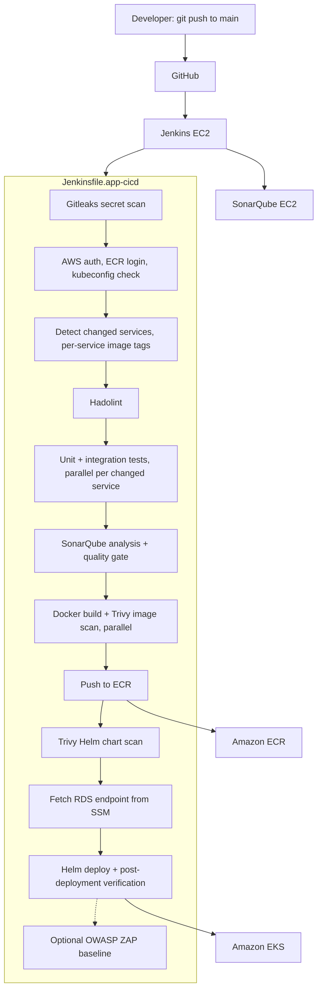
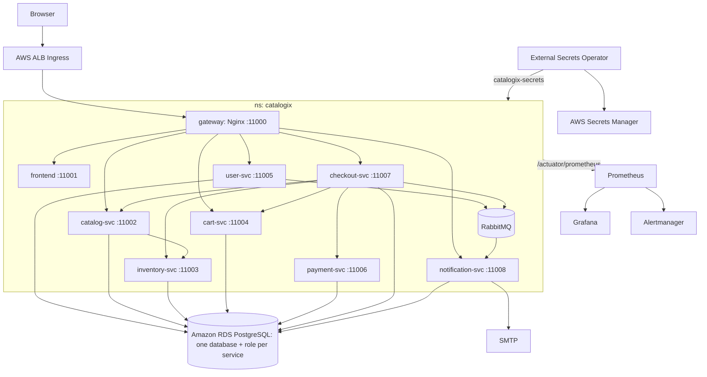

# End-to-End DevSecOps CI/CD Pipeline on AWS

**Terraform · Jenkins · Ansible · Docker · AWS EKS · Helm · SonarQube · Trivy · Gitleaks · External Secrets Operator · Prometheus · Grafana**

> An e-commerce microservices application (Spring Boot, React, PostgreSQL, RabbitMQ) used as the workload for a complete delivery platform: layered infrastructure as code, repeatable server configuration, a CI/CD pipeline with security gates, zero-touch secrets, hardened Kubernetes and monitoring with alerts.

---

## Table of contents

- [What this project demonstrates](#what-this-project-demonstrates)
- [Tech stack](#tech-stack)
- [Architecture](#architecture)
  - [Delivery flow](#delivery-flow)
  - [Runtime architecture](#runtime-architecture)
  - [Services](#services)
  - [EKS namespace layout](#eks-namespace-layout)
- [Application design](#application-design)
- [CI/CD pipelines](#cicd-pipelines)
- [Security integration (DevSecOps)](#security-integration-devsecops)
- [Secrets management](#secrets-management)
- [Infrastructure (Terraform)](#infrastructure-terraform)
- [Server provisioning (Ansible + JCasC)](#server-provisioning-ansible--jcasc)
- [Bootstrap CLI (Python)](#bootstrap-cli-python)
- [Kubernetes hardening](#kubernetes-hardening)
- [Observability](#observability)
- [Local development](#local-development)
- [How to run on AWS](#how-to-run-on-aws)
- [Repository layout](#repository-layout)
- [Design decisions and trade-offs](#design-decisions-and-trade-offs)
- [Known limitations](#known-limitations)

---

## What this project demonstrates

The application is deliberately modest in business logic. It is large enough to need real delivery engineering (several services, a database, a message broker, service-to-service auth) and small enough that the platform around it stays the focus.

- **Automated, secure CI/CD.** A Jenkins pipeline scans for secrets first, lints Dockerfiles, runs tests only for changed services, enforces a SonarQube quality gate, builds and scans every image with Trivy, scans the Helm chart, and only then deploys with Helm to EKS and verifies the rollout.
- **Infrastructure as code in layers.** `backend-bootstrap` (remote state), `bootstrap-infra` (network and CI servers) and `platform-infra` (EKS, RDS, ECR, ALB controller, External Secrets) have separate lifecycles. The platform layer can be destroyed and rebuilt without touching the network.
- **Zero-touch secrets.** Per-service database credentials and the JWT key are generated by Terraform, stored in AWS Secrets Manager and synced into the cluster by External Secrets Operator. No person and no Jenkins credential holds them.
- **Database per service, same locally and on AWS.** One database and one login role per service, created by an init script on Docker Compose, by a Helm template on local Kubernetes, and by a Terraform module on RDS.
- **Production-aligned Kubernetes.** Non-root, read-only containers with all capabilities dropped, startup/readiness/liveness probes, HPA, PodDisruptionBudgets, graceful shutdown, resource requests and limits, and an ALB ingress with optional TLS.
- **Repeatable server setup.** Jenkins and SonarQube are never configured by hand. Ansible provisions them from a dynamic inventory and Jenkins Configuration as Code creates the admin user, tools, credentials and both pipeline jobs on first boot.
- **A bootstrap CLI.** `scripts/python/bootstrap.py` checks dependencies, validates AWS credentials, skips Terraform applies when nothing changed, waits for EC2 health and manages Ansible Vault interactively.
- **Observability with alerts.** Prometheus, Grafana and Alertmanager, with service, JVM, RabbitMQ and checkout-outbox metrics and alert rules. Only `critical` alerts are emailed; `warning` alerts go to a null receiver (visible in Prometheus/Alertmanager only).

---

## Tech stack

| Category | Tools |
|---|---|
| Cloud | AWS: EKS, EC2, RDS, ECR, ALB, Secrets Manager, SSM Parameter Store, IAM, S3 |
| Infrastructure as code | Terraform (S3 remote state with lockfile locking) |
| CI/CD | Jenkins on EC2, configured by Ansible and JCasC, with a shared library (`vars/`) |
| Configuration management | Ansible (dynamic EC2 inventory, idempotent roles, Ansible Vault) |
| Containers | Docker (multi-stage builds, distroless Java images) |
| Orchestration | Kubernetes on Amazon EKS, Helm |
| Static analysis | SonarQube (separate EC2 instance, quality gate enforced) |
| Security scanning | Gitleaks, Hadolint, Trivy (images, Helm chart, Terraform), optional OWASP ZAP |
| Secrets | AWS Secrets Manager + External Secrets Operator |
| Monitoring | kube-prometheus-stack (Prometheus, Grafana, Alertmanager) + `helm/monitoring` |
| Messaging | RabbitMQ (in-cluster StatefulSet, quorum queues) |
| Backend | Java 21, Spring Boot, Flyway, resilience4j, Maven multi-module |
| Frontend | React, Vite, Nginx |
| Database | PostgreSQL (Amazon RDS on AWS, container locally) |
| Tooling | Python 3 bootstrap CLI, bash installers |

---

## Architecture

### Delivery flow


```mermaid
flowchart TD
    Dev[Developer: git push to main] --> GitHub[GitHub]
    GitHub --> Jenkins[Jenkins EC2]

    subgraph CI["Jenkinsfile.app-cicd"]
        direction TB
        S1[Gitleaks secret scan]
        S2[AWS auth, ECR login, kubeconfig check]
        S3[Detect changed services, per-service image tags]
        S4[Hadolint]
        S5[Unit + integration tests, parallel per changed service]
        S6[SonarQube analysis + quality gate]
        S7[Docker build + Trivy image scan, parallel]
        S8[Push to ECR]
        S9[Trivy Helm chart scan]
        S10[Fetch RDS endpoint from SSM]
        S11[Helm deploy + post-deployment verification]
        S12[Optional OWASP ZAP baseline]
        S1 --> S2 --> S3 --> S4 --> S5 --> S6 --> S7 --> S8 --> S9 --> S10 --> S11 -.-> S12
    end

    Jenkins --> CI
    Jenkins --> Sonar[SonarQube EC2]
    S8 --> ECR[Amazon ECR]
    S11 --> EKS[Amazon EKS]
```

### Runtime architecture


```mermaid
flowchart TD
    User[Browser] --> ALB[AWS ALB Ingress]
    ALB --> GW[gateway: Nginx :11000]

    subgraph NS["ns: catalogix"]
        GW --> FE[frontend :11001]
        GW --> USR[user-svc :11005]
        GW --> CAT[catalog-svc :11002]
        GW --> CART[cart-svc :11004]
        GW --> CHK[checkout-svc :11007]
        GW --> NOT[notification-svc :11008]
        CHK --> CAT
        CHK --> CART
        CHK --> INV[inventory-svc :11003]
        CHK --> PAY[payment-svc :11006]
        CAT --> INV
        MQ[(RabbitMQ)]
        USR --> MQ
        CHK --> MQ
        MQ --> NOT
    end

    USR & CAT & INV & CART & PAY & CHK & NOT --> RDS[(Amazon RDS PostgreSQL: one database + role per service)]
    NOT --> SMTP[SMTP]

    ESO[External Secrets Operator] --> SM[AWS Secrets Manager]
    ESO -->|catalogix-secrets| NS
    NS -->|/actuator/prometheus| Prom[Prometheus]
    Prom --> Graf[Grafana]
    Prom --> AM[Alertmanager]
```

`inventory-svc` and `payment-svc` are internal only: the gateway has no route to them.

### Services

| Service | Responsibility |
|---|---|
| `gateway` | Nginx routing, rate limiting, SPA entry point |
| `frontend` | React single-page application |
| `user-svc` | Registration, login, JWT and refresh sessions, password reset, email verification, profiles, addresses, seller requests, admin user management |
| `catalog-svc` | Products, search/filter/sort, ownership, moderation, live stock composition |
| `inventory-svc` | Stock quantities, idempotent reserve/release |
| `cart-svc` | Persistent per-user cart and the cart-to-checkout handoff |
| `payment-svc` | Mock CARD / UPI / COD payments, idempotency, refunds |
| `checkout-svc` | Orders, order state machine, payment orchestration, stock compensation outbox |
| `notification-svc` | RabbitMQ consumer, email delivery, notification audit log |
| `security-common` | Shared library: JWT validation, rate limiting, CORS |

### EKS namespace layout

| Namespace | Workloads | Managed by |
|---|---|---|
| `catalogix` | gateway, frontend, the seven backend services, RabbitMQ | Jenkins (`Jenkinsfile.app-cicd`) / Helm |
| `monitoring` | Prometheus, Grafana, Alertmanager, ServiceMonitors, alert rules, dashboard | Jenkins (`Jenkinsfile.platform-infra`) / Helm |
| `external-secrets` | External Secrets Operator | Terraform (`eso` module) |

---

## Application design

### Checkout saga

`checkout-svc` orchestrates an order across services without a distributed transaction:

1. Read prices from `catalog-svc` and reserve stock in `inventory-svc`, using deterministic operation ids derived from the idempotency key.
2. Persist the order under that idempotency key. If the write fails, the reservations are released.
3. Call `payment-svc` outside any database transaction, so a slow payment never holds a connection. Confirmed, declined and unknown outcomes are handled explicitly. The `PAYMENT_PROCESSING` status stops two concurrent pay or cancel attempts on one order.
4. When stock must be released and the call fails, the release is written to `compensation_outbox`. `CompensationOutboxProcessor` retries it with `FOR UPDATE SKIP LOCKED`, so several replicas can work safely, and moves an entry to `DEAD_LETTER` after five attempts. Dead letters are visible and resolvable in the admin UI (`/admin/outbox`).
5. Confirmation and cancellation publish `order.confirmed` / `order.cancelled` events to RabbitMQ.

Calls between services are synchronous HTTP with resilience4j circuit breakers. They carry short-lived `SYSTEM`-role JWTs: `inventory-svc` accepts stock changes only from them, and `payment-svc` accepts payments only from them.

### Authentication

- Access tokens are short-lived JWTs. Refresh tokens are opaque, stored hashed, delivered in an `httpOnly` cookie and rotated on every use.
- Repeated login failures lock the account temporarily.
- Password reset uses a one-hour single-use token and revokes existing sessions.
- Registration only creates customers. Seller access is request and approval based, and only an admin can grant `SELLER` or `ADMIN`.
- Signing-key rotation is supported through `JWT_SECRET_PREVIOUS`.

### Notifications

`user-svc` publishes `user.email-verification-requested` and `user.password-reset-requested`. `checkout-svc` publishes `order.confirmed` and `order.cancelled`. `notification-svc` consumes them, sends email over SMTP (Mailpit locally) and records the result in `notification_log`. RabbitMQ keeps request handling independent of SMTP availability. Consumer failures go to a dead-letter queue instead of retrying forever.

### Data

Each backend service has its own database and login role, identical locally and on AWS. Flyway owns every schema (one `V1__init.sql` per service) and Hibernate only validates (`ddl-auto=validate`).

| Service | Role | Database |
|---|---|---|
| user-svc | `user_svc` | `catalogix-users` |
| catalog-svc | `catalog_svc` | `catalogix-catalog` |
| inventory-svc | `inventory_svc` | `catalogix-inventory` |
| cart-svc | `cart_svc` | `catalogix-cart` |
| payment-svc | `payment_svc` | `catalogix-payment` |
| checkout-svc | `checkout_svc` | `catalogix-checkout` |
| notification-svc | `notification_svc` | `catalogix-notification` |

This is role-level isolation on one shared Postgres instance, not one instance per service. Database names contain hyphens, so they must be quoted in SQL. The init script does this with `%I`.

| Environment | Created by |
|---|---|
| Docker Compose | `postgres-init/01-create-databases.sh`, on first start of an empty volume |
| Local Kubernetes | `helm/catalogix-hc/templates/postgres-local.yaml` (passwords from `secrets-local.yaml`) |
| AWS RDS | `terraform/platform-infra/modules/db-roles` (PostgreSQL provider) |

The three must use the same names. On AWS the JDBC URL uses `sslmode=require`, locally `disable`.

---

## CI/CD pipelines

Two Jenkins pipelines, both created automatically by JCasC.

### `Jenkinsfile.app-cicd` (push to `main` via webhook, or manual)

> The Jenkins security group allows :8080 only from the operator IP, so GitHub cannot deliver a webhook by default. Either add an SG rule for GitHub hook CIDRs or trigger the job manually.

| Stage | What it does |
|---|---|
| Secrets scanning | Gitleaks over the full history. Any finding fails the build |
| AWS authentication, ECR login, Kubernetes access | Resolves the account, registry and image tag, and verifies the kubeconfig points at the selected environment's cluster |
| Detect changed services | Diffs against the last successful build. A change to `security-common` selects every backend service |
| Determine per-service image tags | Rebuilt services get the new tag. Unchanged services keep the tag read back from the live Helm release, so their pods are not restarted |
| Hadolint | Lints every Dockerfile |
| Unit and integration tests | Parallel stages generated from the `BACKEND_SERVICES` list, so adding a service is a one-line change. Testcontainers provides PostgreSQL |
| SonarQube analysis and quality gate | Scanner on the monorepo, then waits for the webhook and aborts on a failed gate |
| Build and Trivy image scan | Images built and scanned in parallel by the shared-library function `buildAndScanImage`. Fixable HIGH/CRITICAL findings fail the build |
| Push to ECR | Tagged `<major>-<build number>`, with retry |
| Trivy Helm scan | Kubernetes misconfiguration scan of the chart |
| Fetch RDS endpoint | Read from SSM Parameter Store, never hard-coded |
| Deploy and verification | `helm upgrade --install`, then rollout and health checks |
| OWASP ZAP baseline | Optional (`RUN_DAST`), not part of the deployment gate |

Parameters: `ENV` (dev or staging), `FORCE_ALL_TESTS`, `FORCE_ALL_BUILDS`, `CLEAR_MAVEN_CACHE`, `RUN_DAST`, `INGRESS_HOST`, `TLS_CERT_ARN`.

CVEs accepted in `.trivyignore` carry the package, CVE id, severity, reason, a revisit condition and an expiry date, after which Trivy stops honouring them.

### `Jenkinsfile.platform-infra` (manual)

`ACTION=Apply` runs: precheck of bootstrap state, operator-credentials check, Trivy IaC scan, `terraform init`, `validate`, `plan`, human approval, `apply`, wait for EKS, metrics server, then the monitoring stack and its verification. `DEPLOY_APP_AFTER_INFRA` can chain the application deploy.

`ACTION=Destroy` requires `CONFIRM_DESTROY=true`, shows a destroy plan, asks for approval, cleans up Kubernetes resources that own cloud objects (load balancers, volumes), runs `terraform destroy` and deletes the operator-credentials secret.

---

## Security integration (DevSecOps)

Security is enforced at several points in the pipeline, not after deployment.

| Control | Where | On failure |
|---|---|---|
| Gitleaks secret scan | Before anything else | No code runs |
| Hadolint | Before build | Build fails |
| SonarQube quality gate | After tests | Nothing is built or pushed |
| Trivy image scan | After each build | Image is not pushed to ECR |
| Trivy Helm and Terraform scan | Before deploy and before apply | Deploy or apply does not run |
| Non-root, read-only filesystem, capabilities dropped | Pod spec | Container does not start or write |
| Per-service DB credentials | Secrets Manager + ESO | One service cannot open another's database |
| Secrets never in the pipeline | ESO | No Jenkins credential holds a DB or JWT secret |
| EKS API endpoint restricted | `public_access_cidrs` | Limited to Jenkins and the deployer |
| Service-to-service auth | `SYSTEM`-role JWTs | Internal endpoints reject user tokens |

---

## Secrets management

No DB password or JWT secret is typed by a person or stored as a CI credential.

1. `db-roles` generates one `random_password` per service and creates its role and database.
2. The dev root module merges them with the JWT key into one Secrets Manager secret, `<cluster>/app-secrets`. There is a single writer on purpose, because two Terraform resources owning one secret's version overwrite each other.
3. The `eso` module installs External Secrets Operator with IRSA, allowed only `GetSecretValue` and `DescribeSecret` on this environment's secrets.
4. One `ExternalSecret` (`dataFrom.extract`) creates the `catalogix-secrets` Kubernetes Secret and refreshes it hourly. New keys appear without template changes.
5. Each Deployment reads its own `db_user_<svc>` and `db_password_<svc>`.

Passwords a human must choose (RDS master, RabbitMQ, bootstrap admin, Grafana) are set once with `python scripts/python/bootstrap.py credentials`. They are stored in `<cluster>/operator-credentials`, which Terraform and External Secrets read. Only the RDS master password passes through Terraform state. Policy: 8 to 64 characters with a lowercase letter, an uppercase letter and a digit, and none of `/ " @` or whitespace. Both pipelines refuse to run until the secret is complete, and the platform `Destroy` deletes it.

To change one later, run `credentials.py --env dev --only <key>`, then re-run platform-infra for the RDS master, restart Grafana with `kubectl rollout restart deploy/monitoring-grafana -n monitoring`, or delete the RabbitMQ PVC in dev (the broker reads its user only on first start). To inspect RDS from a laptop, tunnel through the Jenkins host and use the optional read-only role, which can only `SELECT`.

---

## Infrastructure (Terraform)

```text
terraform/
  backend-bootstrap/   S3 bucket for remote state (lockfile locking)
  bootstrap-infra/     VPC, subnets, NAT, Jenkins and SonarQube EC2, IAM, security groups, key pair
  platform-infra/
    env/dev, env/staging
    modules/
      eks/             cluster, managed node group, OIDC/IRSA, EBS CSI, gp3 StorageClass
      ecr/             one private repository per image
      rds/             PostgreSQL 18, encrypted, private, endpoint published to SSM
      db-roles/        per-service database and role, optional read-only login
      alb/             AWS Load Balancer Controller (Helm + IRSA)
      eso/             External Secrets Operator + ClusterSecretStore
      secrets-manager/ generic secret writer
      security-groups/ scoped per component, no open 0.0.0.0/0 rules
```

The network is applied once and left alone. `platform-infra` reads it through `terraform_remote_state`, so subnet ids are never copied by hand and the cluster can be rebuilt independently.

Notable choices:
- **EKS:** Kubernetes 1.36, managed node group (dev: min 2, desired 4, max 5), OIDC provider for IRSA, EBS CSI driver with its own scoped role. Add-ons are pinned (vpc-cni, coredns, kube-proxy, EBS CSI) to prevent silent upgrades.
- **Storage:** the `gp3` StorageClass uses `WaitForFirstConsumer` and is not the cluster default.
- **RDS:** PostgreSQL 18.1 on `db.t4g.micro`, encrypted, `publicly_accessible = false`. The PostgreSQL provider connects from the Jenkins host, which the RDS security group allows.
- **ESO:** installed with `wait = true` so the CRDs exist before the `ClusterSecretStore` is created, with a trust policy limited to the ESO service account.
- **Environments:** `env/dev` is the maintained environment. `env/staging` shows the multi-environment pattern and is not kept in lockstep.

---

## Server provisioning (Ansible + JCasC)

Ansible provisions the two EC2 servers from a dynamic inventory (`aws_ec2.yaml`) that discovers hosts by tag, so IP changes do not matter.

| Play | Target | Roles |
|---|---|---|
| Baseline | all | `common`, `docker` |
| SonarQube | `sonarqube` | `sonarqube` (Docker container) |
| Jenkins | `jenkins` | `devops-tools` (kubectl, Helm, Trivy, AWS CLI, Sonar Scanner), `jenkins` |

It runs in two phases so the SonarQube token exists before Jenkins is configured: everything except Jenkins first (which writes `vault_sonar_token` to the vault), then Jenkins in a fresh process. Tool versions live in `group_vars/all/vars.yaml` and each install checks the installed version first, so re-running is idempotent.

JCasC configures Jenkins on first boot: the admin user, the SonarQube connection, Maven and Node.js tools, credentials from the environment, and both pipeline jobs. Jenkins starts with the jobs already present.

---

## Bootstrap CLI (Python)

`scripts/python/bootstrap.py` is the intended entry point. Plain-bash installers for the prerequisites are in `scripts/bash`.

```bash
python3 bootstrap.py              # backend, infra, ansible, credentials
python3 bootstrap.py backend      # S3 state backend only
python3 bootstrap.py infra        # bootstrap-infra only
python3 bootstrap.py ansible      # Ansible only (EC2 servers must be running)
python3 bootstrap.py credentials  # operator-chosen passwords
```

What it handles:
- **Dependencies:** checks `terraform`, `aws`, `ansible-playbook`, `jq` and `boto3`, and offers to install what is missing.
- **AWS auth:** runs `aws sts get-caller-identity` first and fails with a clear message instead of failing mid-apply.
- **Idempotent Terraform:** `terraform plan -detailed-exitcode` skips `apply` when nothing changed (exit 0), and prints the plan and asks for confirmation when something did (exit 2).
- **Ansible Vault:** creates `~/.vault_pass` and `vault.yaml` interactively with hidden input, encrypts immediately, and allows three retries on a wrong password.
- **EC2 health:** waits with `aws ec2 wait instance-status-ok` before Ansible runs.
- **Retries:** `utils/command.py` retries commands with exponential back-off and replaces known errors (S3 unreachable, access denied, bad vault password) with an actionable message.

`destroy_infra.py` tears down `bootstrap-infra`. Run the platform destroy first. `scripts/python/local_scans` holds the local pre-AWS checks. They are not used by Jenkins, but they use the same tool versions (read from `ansible/group_vars/all/vars.yaml`) and the same scanner images:

```bash
cd scripts/python/local_scans
python3 gitleaks.py                                   # secrets (history if .git exists, else working tree)
python3 run_local.py --frontend-coverage              # mvn clean verify + npm ci/test/build   (Docker must be running)
python3 sonarqube_local.py --start-server --build     # SonarQube container + token + quality gate
python3 trivy_local.py all --build                    # source, Terraform, Helm chart (dev + local values), images
python3 compose.py start && python3 smoke_test.py     # Docker Compose stack + end-to-end checks
python3 devsecops_check.py --start-sonarqube          # all of the above in order
```

---

## Kubernetes hardening

The chart is `helm/catalogix-hc`. One generic template renders every backend service from `backendServices` in the values file.

```yaml
securityContext:
  runAsNonRoot: true
  readOnlyRootFilesystem: true
  allowPrivilegeEscalation: false
  capabilities:
    drop: [ALL]
```

- **Read-only root filesystem with Spring Boot:** Tomcat writes to `/tmp`, so an `emptyDir` is mounted there.
- **Unprivileged ports:** gateway 11000, frontend 11001, services 11002 to 11008. No capability has to be added back.
- **Probes:** a startup probe allowing 150 s for JVM start, plus readiness and liveness on the actuator endpoints. An init container waits for Postgres, and for RabbitMQ on the services that use it.
- **Scaling:** HPA on CPU (75 %) for every service, with PodDisruptionBudgets everywhere. Memory is not an HPA metric because a JVM heap stays committed after load drops. Dev runs 2 to 3 replicas for most services.
- **Connection budget:** `database.maxPoolSize` is set so `pods x pool` stays under the connection limit of a `db.t4g.micro`.
- **Graceful shutdown:** a short `preStop` sleep and `server.shutdown=graceful` stop rolling updates from dropping requests.
- **Ingress:** ALB through the AWS Load Balancer Controller. Supplying `INGRESS_HOST` and `TLS_CERT_ARN` turns on the host rule, HTTPS listener, redirect, public URL used in emails and the `Secure` cookie flag together.
- **RabbitMQ:** StatefulSet with quorum queues, one replica in dev. The clustering code is in place, but real HA needs at least three nodes.
- **Values files:** `values-dev.yaml` and `values-staging.yaml` for AWS, `values-local.yaml` as a local overlay.

---

## Observability

Monitoring is cluster infrastructure, deployed by the platform pipeline (kube-prometheus-stack plus `helm/monitoring`), so it does not restart on every application push.

- **Metrics:** services expose `/actuator/prometheus` and are scraped through ServiceMonitors. Collected: availability, request rate, 5xx rate, p95 latency, JVM CPU and heap, RabbitMQ queue depth and consumers (the `rabbitmq_prometheus` plugin), and `checkout_outbox_pending_count` / `checkout_outbox_dead_letter_count`.
- **Dashboard:** one Grafana dashboard (`helm/monitoring/dashboards`) and datasource, loaded from labelled ConfigMaps and kept in version control.
- **Alerts:** `ServiceUnavailable`, `HighErrorRate`, `HighLatencyP95`, `PodCrashLooping`, `OutboxDeadLetterBacklog`, `RabbitMQQueueBacklogGrowing`, `DeadLetterQueueNotEmpty` and `RabbitMQQueueNoConsumers`. The dead-letter alert does not clear by itself and is resolved from the admin UI.
- **Delivery:** email only, and only for `severity=critical`; warnings are routed to a null receiver. One working channel shows the Terraform, Secrets Manager, ESO and Alertmanager chain as well as several would.
- **Logs:** container stdout and stderr (`kubectl logs`, `docker logs`). There is no log aggregation or tracing backend.

---

## Local development

### Docker Compose

```bash
cp .env.example .env     # set JWT_SECRET (openssl rand -base64 48) and the passwords
docker compose up --build
```

| URL | What |
|---|---|
| http://localhost:11000 | Application (only the gateway is published) |
| http://localhost:8025 | Mailpit, where verification and reset emails arrive |
| http://localhost:25672 | RabbitMQ management UI |

Local admin login: `admin@catalogix.local` / `AdminAdminAdmin`.

- `POSTGRES_PASSWORD` and `SERVICE_DB_PASSWORD` are read only when the Postgres volume is first created. After changing them, or after pulling a schema change, run `docker compose down -v`.
- Every container has memory and CPU limits; the full stack needs roughly 6 GB RAM and 4 CPUs.
- To work on one service: `docker compose up postgres rabbitmq payment-svc`.
- Java containers are distroless and have no healthcheck, so Compose only orders their start. Calls made before a dependency is ready fail fast through the circuit breakers.

### Local Kubernetes (Docker Desktop, kind, minikube)

```bash
helm upgrade --install catalogix ./helm/catalogix-hc \
  -f helm/catalogix-hc/values-dev.yaml \
  -f helm/catalogix-hc/values-local.yaml \
  -n catalogix --create-namespace
```

The local overlay swaps RDS for an in-cluster Postgres, External Secrets for generated secrets, disables the ALB and HPA and pins every service to one replica. Images must already exist locally (`docker compose build`).

### Tests

```bash
mvn test                    # backend
cd frontend && npm test     # frontend (vitest)
```

The suites target behaviour and failure modes: the saga and its compensation, idempotency, concurrency, token handling and authorization. Some integration tests need Docker for Testcontainers.

---

## How to run on AWS

**Prerequisites:** an AWS account (default region `ap-south-1`; change `AWS_REGION` and `CLUSTER_NAME` in both Jenkinsfiles), Terraform 1.12 or newer, Ansible, Python 3, and an AWS CLI profile allowed to create the bootstrap resources. Prefer a scoped IAM user over AdministratorAccess and delete its key once bootstrap is done.

1. **Bootstrap.** `cd scripts/python && python3 bootstrap.py` creates the state bucket, the VPC and the two EC2 servers, then configures them with Ansible, so Jenkins comes up with both jobs present.
   Manual route: `terraform apply` in `terraform/bootstrap-infra`, then `ansible-playbook playbook.yaml` in `ansible/` with the Jenkins, GitHub and SonarQube credentials exported.
2. **Credentials.** `python3 bootstrap.py credentials`.
3. **Platform.** Run `Jenkinsfile.platform-infra` with `ACTION=Apply` (EKS, RDS, ECR, ALB controller, ESO, monitoring).
4. **Application.** Push to `main`, or run `Jenkinsfile.app-cicd` for the chosen environment.
5. **Destroy.** Run `Jenkinsfile.platform-infra` with `ACTION=Destroy` and `CONFIRM_DESTROY=true` first, then `python3 destroy_infra.py` for the bootstrap layer. The S3 state bucket is left in place on purpose.

---

## Repository layout

```text
backend/            security-common and the seven services (Maven multi-module, root pom.xml)
frontend/           React/Vite app, Nginx image
gateway/            Nginx gateway
helm/catalogix-hc/  application chart
helm/monitoring/    ServiceMonitors, alert rules, dashboard, datasource, Alertmanager and Grafana secrets
terraform/          backend-bootstrap, bootstrap-infra, platform-infra
ansible/            playbook, roles (common, docker, devops-tools, jenkins, sonarqube), dynamic inventory
vars/               Jenkins shared library (buildAndScanImage, getChangedServices, ensureKubernetesAccess, pushImageWithRetry)
scripts/            Python bootstrap CLI, local scan helpers, bash installers, CI helper checks
postgres-init/      per-service databases and roles for Docker Compose
Jenkinsfile.app-cicd, Jenkinsfile.platform-infra, docker-compose.yaml, sonar-project.properties
```

---

## Design decisions and trade-offs

1. **Jenkins on EC2 instead of a managed CI service.** It reflects self-managed CI at product companies and forced a repeatable setup (Ansible and JCasC). *Trade-off:* the server must be patched and run.
2. **SonarQube on its own instance.** Analysis is memory-heavy and would compete with builds. *Trade-off:* a second server to pay for and manage.
3. **External Secrets instead of Jenkins credentials.** Nobody handles DB passwords and secrets stay in sync with Secrets Manager. *Trade-off:* ESO is one more component. If it stops, existing secrets keep working until a pod restarts.
4. **Two Terraform layers plus a state bootstrap.** The network can change without touching the cluster. *Trade-off:* apply order is a convention, not enforced in code.
5. **Monitoring from the platform pipeline.** An application commit never restarts Prometheus. *Trade-off:* the monitoring stack needs its own trigger.
6. **Per-service image tags.** Only changed services are rebuilt, and unchanged ones keep their live tag so their pods are not restarted. *Trade-off:* the previous tag is read back from the Helm release, so `FORCE_ALL_BUILDS` exists to reset it.
7. **Trivy ignores unfixed CVEs.** Blocking on findings with no patch gives no benefit. *Trade-off:* they are hidden from pipeline output. The documented, expiring `.trivyignore` is the compensating control.
8. **RabbitMQ for email.** Password-reset and order emails do not depend on SMTP being up at request time. *Trade-off:* a stateful broker to run.
9. **Database per service on one instance.** Real isolation by role without paying for seven RDS instances. *Trade-off:* it is not failure isolation.
10. **Python CLI plus bash scripts.** The CLI handles vault creation, missing tools and no-change plans. The bash installers are shorter to audit and need no Python. *Trade-off:* Python 3 must be on the operator's machine.
11. **No further splitting.** No service discovery, config server or BFF. Kubernetes DNS and the gateway are enough at this scale.

---

## Known limitations

| Limitation | Note |
|---|---|
| Single NAT gateway (`nat_gateway_count`) | One per AZ for production |
| HTTP unless `INGRESS_HOST` and `TLS_CERT_ARN` are supplied | Enable HTTPS for anything real |
| `skip_final_snapshot`, ECR `force_delete`, zero Secrets Manager recovery window | Dev conveniences, not environment-aware |
| RabbitMQ runs with one replica | Needs at least three nodes for real HA |
| `env/staging` is not kept in step with `env/dev` | Shown as the multi-environment pattern only |
| No NetworkPolicies, tracing or log aggregation | Out of scope at this stage |
| Alerts go to email only | One channel is enough to prove the chain |
| Validated statically | Terraform, Helm and Java were reviewed and cross-checked. A clean `mvn verify`, `terraform plan` and `helm template` run is the check that matters before relying on it |
